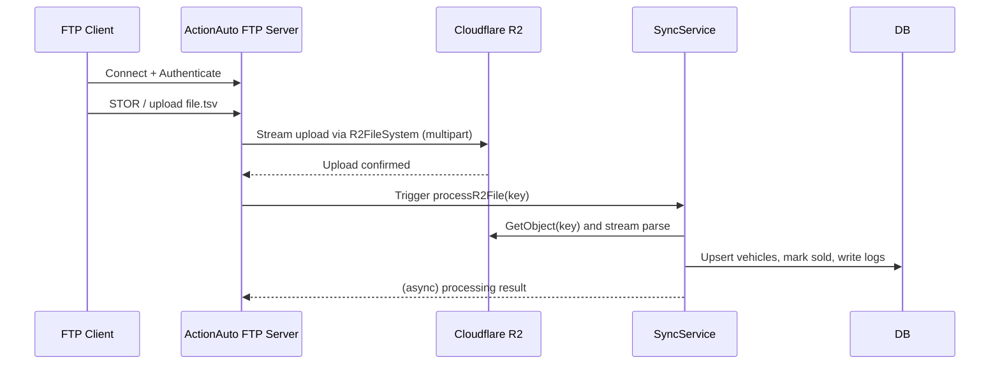

# FTP Worker & R2-backed FTP Server

## Overview
- Purpose: Standalone FTPS/FTP worker that accepts uploads (DealersCloud inventory files) and streams them directly to Cloudflare R2, then triggers inventory sync processing.
- Entry point: [src/ftp-worker.ts](src/ftp-worker.ts#L1-L120)
- Server implementation: [src/services/ftp-server.service.ts](src/services/ftp-server.service.ts#L1-L240)
- R2 filesystem bridge: [src/services/r2-ftp-fs.service.ts](src/services/r2-ftp-fs.service.ts#L1-L360)
- Inventory parser + sync: [src/services/sync.service.ts](src/services/sync.service.ts#L1-L360)

## Architecture (high level)
- FTP client (DealersCloud or manual) -> FTP control connection (port 21 by default)
- Authentication: single username/password from env configured in `ftpServerConfig`
- File operations are handled by an S3-compatible bridge (`R2FileSystem`) which streams uploaded data into Cloudflare R2
- After a successful upload to R2, the worker triggers the inventory processing pipeline (`syncService.processR2File`) which reads the object from R2 and streams it into the TSV parser and database update logic.

Mermaid sequence (simplified):



## How it works (detailed)
- The worker process is started from [src/ftp-worker.ts](src/ftp-worker.ts#L1-L120). It connects to MongoDB, then calls `actionFtpServer.start()`.
- The server uses `ftp-srv` to accept connections; configuration values are read from `src/config/ftp-server.config.ts` and `src/config/index.ts` (the latter validates environment variables).
- When a client logs in successfully, the server resolves the login with an instance of `R2FileSystem` which implements the FTP `FileSystem` API and translates file operations to S3/R2 API calls. See [src/services/r2-ftp-fs.service.ts](src/services/r2-ftp-fs.service.ts#L1-L360).
- Uploads: the `write()` implementation in `R2FileSystem` creates a `PassThrough` stream and uses `@aws-sdk/lib-storage` Upload for multipart streaming to R2. Once upload finishes, it optionally triggers `syncService.processR2File(key)` for DealersCloud-related keys.
- The FTP server also listens to the `STOR` event and will call `syncService.processR2File` for uploaded files ending in `.csv`/`.txt` (defensive duplication).

## File format expectations
- DealersCloud feed is TSV (tab-delimited) with a header row. The parser is configured using `csv-parse` with `delimiter: '\t'` and trims headers to lowercase. See field mapping in [src/services/ftp.service.ts](src/services/ftp.service.ts#L1-L220) and the `RawVehicleData` interface.
- Typical important fields: `vin`, `make`, `model`, `year`, `price`, `mileage`, `picture urls`, `stock number`, `dealer id`, `dealer name`, etc.

## Environment variables / configuration
Primary configuration is in [src/config/index.ts](src/config/index.ts#L1-L220) and `ftp-server.config.ts`.

Key FTP-related vars (names and defaults):
- `FTP_SERVER_PORT` — control port (default: `2121` for dev; `21` in production). See [src/config/ftp-server.config.ts](src/config/ftp-server.config.ts#L1-L80).
- `FTP_PASSIVE_URL` — public IP/hostname used for passive mode (CRITICAL for clients behind NAT). Default: `127.0.0.1`.
- `FTP_PASV_MIN` / `FTP_PASV_MAX` — passive data port range (default: `21000`–`21010`).
- `FTP_SERVER_USER` / `FTP_SERVER_PASSWORD` — basic auth credentials (defaults provided; change in prod).
- `FTP_UPLOAD_DIR` — local upload dir when used (default: `./ftp-uploads`).
- `FTP_FORCE_TLS` — boolean; when `true` and `NODE_ENV=production` TLS certs are required.
- `FTP_TLS_CERT_PATH` / `FTP_TLS_KEY_PATH` — paths to FTPS certificate and key (PEM files). If `FTP_FORCE_TLS` is true in production and these are missing, startup will fail.

R2 / Cloud storage variables (must be set for R2-backed mode):
- `R2_ACCESS_KEY_ID`, `R2_SECRET_ACCESS_KEY`, `R2_ENDPOINT` — required in production (see [src/config/index.ts](src/config/index.ts#L1-L220)).
- `R2_BUCKET_FTP` — bucket used for FTP uploads (default `actionauto-ftp`).

Sync-related and other environment variables (required by worker runtime):
- `MONGODB_URI` — MongoDB connection string
- `REDIS_*` — if Redis is enabled; cache invalidation depends on it
- `JWT_*`, `BCRYPT_SALT_ROUNDS` — required by top-level config validation in this repo

Example minimal `.env` snippet (production-ready values omitted):

```
NODE_ENV=production
PORT=3001
MONGODB_URI=mongodb://mongo:27017/actionauto

# FTP
FTP_SERVER_PORT=21
FTP_PASSIVE_URL=203.0.113.45
FTP_PASV_MIN=21000
FTP_PASV_MAX=21010
FTP_SERVER_USER=dealerscloud
FTP_SERVER_PASSWORD=supersecret
FTP_FORCE_TLS=true
FTP_TLS_CERT_PATH=/etc/letsencrypt/live/yourdomain/fullchain.pem
FTP_TLS_KEY_PATH=/etc/letsencrypt/live/yourdomain/privkey.pem

# R2
R2_ACCESS_KEY_ID=...
R2_SECRET_ACCESS_KEY=...
R2_ENDPOINT=https://<accountid>.r2.cloudflarestorage.com
R2_BUCKET_FTP=actionauto-ftp

# Required by config validation
BCRYPT_SALT_ROUNDS=10
JWT_ACCESS_SECRET=...
JWT_REFRESH_SECRET=...

```

## Running the FTP worker

1. Locally (development):

```
npm run dev:ftp
```

This uses `ts-node-dev` to run `src/ftp-worker.ts` directly (see `package.json`).

2. Build & run (production):

```
npm run build
npm run start:ftp
```

`start:ftp` runs `node dist/ftp-worker.js`.

3. Docker (recommended for production):

- Image: `Dockerfile.ftp` builds a two-stage image and runs `dist/ftp-worker.js`. See [Dockerfile.ftp](Dockerfile.ftp#L1-L120).
- Compose: there is an example service at [deploy/docker-compose.ftp.yml](deploy/docker-compose.ftp.yml#L1-L200). It maps control port `21` and passive ports `21000-21010` and mounts `/etc/letsencrypt` for TLS certs.

Command to build and run locally via compose (from `deploy/`):

```bash
docker-compose -f deploy/docker-compose.ftp.yml up --build -d
```

Ensure `VPS_PUBLIC_IP` and required env vars are present in the `.env` referenced by the compose file.

## How to connect (client examples)

1. `lftp` (recommended test client):

```bash
lftp -u "${FTP_SERVER_USER},${FTP_SERVER_PASSWORD}" -p ${FTP_SERVER_PORT} ${FTP_PASSIVE_URL}
lftp> put local-inventory.tsv -o DealersCloud.txt
```

2. `curl` (simple upload):

```bash
curl -T local-inventory.tsv ftp://${FTP_SERVER_USER}:${FTP_SERVER_PASSWORD}@${FTP_PASSIVE_URL}:${FTP_SERVER_PORT}/DealersCloud.txt
```

3. FTP GUI clients: FileZilla, Cyberduck — set protocol to FTP or FTPS (explicit) depending on TLS configuration. If using FTPS (TLS), select explicit TLS and provide the certificate trust.

Notes about Passive Mode:
- Passive mode requires the server to advertise its external IP (`FTP_PASSIVE_URL`) and open the passive port range on the firewall/load balancer. The Docker compose maps `21000-21010` in the example.

## Testing & verification

1. Health: the `docker-compose.ftp.yml` includes a basic `nc` healthcheck on the control port.
2. Upload test: upload a small TSV and confirm it appears in the R2 bucket. You can verify R2 via S3-compatible tools using the configured endpoint and credentials.

Example using AWS CLI v2 (S3-compatible endpoint):

```bash
AWS_ACCESS_KEY_ID=$R2_ACCESS_KEY_ID AWS_SECRET_ACCESS_KEY=$R2_SECRET_ACCESS_KEY \
aws --endpoint-url "$R2_ENDPOINT" s3 ls s3://$R2_BUCKET_FTP/ --no-sign-request
```

3. Application flow test: after upload, watch the worker logs — it logs R2 upload progress and will log when `syncService` starts processing. See `syncService` logs in [src/services/sync.service.ts](src/services/sync.service.ts#L1-L360).

4. Functional test: after a successful sync, query the vehicles collection in MongoDB for newly added/updated records.

## Troubleshooting
- TLS missing in production when `FTP_FORCE_TLS=true` will cause startup to fail — ensure cert paths and file permissions are correct. See the checks in [src/services/ftp-server.service.ts](src/services/ftp-server.service.ts#L1-L120).
- Passive mode failures: ensure `FTP_PASSIVE_URL` is your public IP or DNS and that the passive port range is open through host firewall and cloud/VPS security groups.
- R2 auth/upload errors: check `R2_ACCESS_KEY_ID`, `R2_SECRET_ACCESS_KEY`, `R2_ENDPOINT` and `R2_BUCKET_FTP`. Ensure the bucket exists and the account has permissions.
- Large file uploads: the upload pipeline uses multipart via `@aws-sdk/lib-storage`; monitor memory and upload progress. If uploads stall, check network/firewall issues and the AWS SDK logs.
- Authentication failures: verify `FTP_SERVER_USER` and `FTP_SERVER_PASSWORD` match the credentials used by your client.

## Security considerations
- Do not store credentials in plaintext `.env` in source control. Use secrets manager or environment injection in CI/CD.
- Prefer FTPS (explicit TLS) for production: set `FTP_FORCE_TLS=true` and provide valid certificates.
- Limit passive port range and restrict access via firewall to known client IPs where possible.
- Rotate the FTP account password regularly and consider per-dealer credentials if needed.

## Operational notes
- The worker is designed to be stateless: uploaded files are streamed to R2 and the local upload directory is optional/persistent only for debugging (`FTP_UPLOAD_DIR`).
- The worker will create `SyncLog` and `AuditLog` entries in MongoDB for traceability; monitor these collections for failure patterns.
- The sync pipeline runs per-upload; additional scheduled syncs are controlled by `SYNC_SCHEDULE` if configured.

## References (code)
- Entry point: [src/ftp-worker.ts](src/ftp-worker.ts#L1-L120)
- FTP server implementation: [src/services/ftp-server.service.ts](src/services/ftp-server.service.ts#L1-L240)
- R2 bridge implementation: [src/services/r2-ftp-fs.service.ts](src/services/r2-ftp-fs.service.ts#L1-L360)
- Inventory FTP client & parser: [src/services/ftp.service.ts](src/services/ftp.service.ts#L1-L240)
- Sync logic: [src/services/sync.service.ts](src/services/sync.service.ts#L1-L360)
- Config: [src/config/ftp-server.config.ts](src/config/ftp-server.config.ts#L1-L200) and [src/config/index.ts](src/config/index.ts#L1-L220)
- Docker setup: [Dockerfile.ftp](Dockerfile.ftp#L1-L120) and [deploy/docker-compose.ftp.yml](deploy/docker-compose.ftp.yml#L1-L200)

---

If you want, I can now:
- add this file to `docs/DOCUMENTATION_INDEX.md` and link it under `guides/`, and
- generate a quick checklist and CI script that validates FTP-related env vars and passive ports at startup.