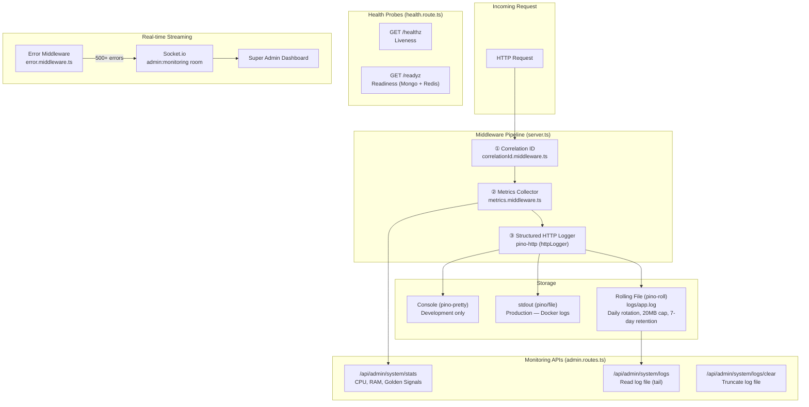
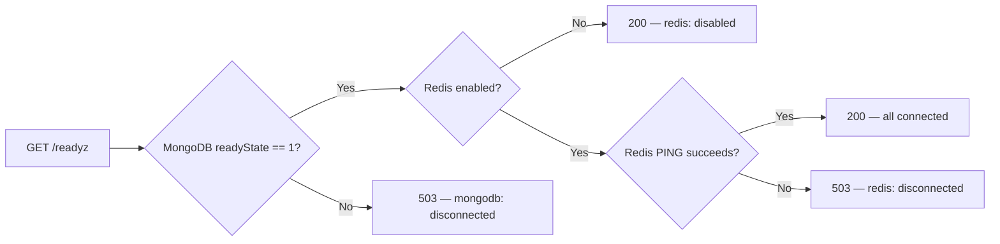

# ActionAutoBackend — Monitoring & Logging System Documentation

> **Branch:** `email-leads`
> **Last Audit:** April 7, 2026
> **Status:** Implementation complete — uncommitted new files pending

---

## Table of Contents

1. [Architecture Overview](#architecture-overview)
2. [Multi-Repo Synchronization](#multi-repo-synchronization)
3. [System Components](#system-components)
4. [Data Flow](#data-flow)
5. [Change Audit](#change-audit)
6. [API Reference](#api-reference)
7. [Verification Checklist](#verification-checklist)

---

## Architecture Overview

The monitoring and logging system is built around **five pillars**, all wired into the Express middleware pipeline and Socket.io layer:



---

## Multi-Repo Synchronization (Frontend ↔ Backend)

The Monitoring & Logging system is split across two primary repositories. Developers must ensure that any path changes in the backend are mirrored in the frontend service layer to prevent **404 regressions**.

| Feature | Backend Endpoint (`ActionAutoBackend`) | Frontend Service (`actionautoutah`) |
| :--- | :--- | :--- |
| **System Stats** | `GET /api/admin/system/stats` | `admin.service.ts` -> `getProcessStats()` |
| **Cloud Logs** | `GET /api/admin/system/logs` | `admin.service.ts` -> `getSystemLogs()` |
| **Log Cleansing** | `POST /api/admin/system/logs/clear` | `admin.service.ts` -> `clearSystemLogs()` |
| **Activity Feed** | `GET /api/activity/organization` | `admin.service.ts` -> `getGlobalActivity()` |

---

## System Components

### 1. Structured Logger — Pino

**File:** [logger.ts](file:///c:/Users/jloyd/Documents/GitHub/ActionAutoBackend/src/utils/logger.ts)
**Status:** 🟡 New file (untracked)

| Feature | Detail |
|---|---|
| **Library** | `pino` v10.3.1 + `pino-http` v11.0.0 |
| **Log Level** | `debug` in development, `info` in production |
| **Timestamp** | ISO 8601 (`pino.stdTimeFunctions.isoTime`) |
| **Base Fields** | `env` (NODE_ENV) attached to every log line |
| **Format** | `level` field uppercased (`INFO`, `ERROR`, etc.) |

#### PII Redaction

Sensitive fields are automatically masked with `[REDACTED]`:

```
req.headers.authorization
req.body.password
req.body.token
req.body.creditCard
req.body.ssn
res.headers["set-cookie"]
```

#### Transport Configuration

| Transport | Environment | Target | Behavior |
|---|---|---|---|
| `pino-pretty` | Development | Console (colorized) | Ignores `pid,hostname`, human-readable timestamps |
| `pino/file` | Production | `stdout` (fd 1) | Structured JSON — collected by Docker/PM2 |
| `pino-roll` | All | `logs/app.log` | Daily rotation, 20MB max per file, 7-day retention |

#### HTTP Request Logger (`pino-http`)

Automatically logs every request/response with:

- **Request ID**: Re-uses `X-Request-Id` header or generates a `crypto.randomUUID()`
- **Custom request serializer**: `id`, `method`, `url`, `query`, `remoteAddress`, `organizationId`, `userId`
- **Custom response serializer**: `statusCode` only
- **Success message**: `GET /api/foo completed with 200`
- **Error message**: `POST /api/bar failed with 500: Something went wrong`

---

### 2. Correlation ID Middleware

**File:** [correlationId.middleware.ts](file:///c:/Users/jloyd/Documents/GitHub/ActionAutoBackend/src/middleware/correlationId.middleware.ts)
**Status:** 🟡 New file (untracked)

Every request gets a unique UUID that flows through the entire logging pipeline:

```
Client → [X-Request-Id header] → Middleware → req.id → pino-http → log output
                                            → res header (X-Request-Id) → Client
```

| Behavior | Detail |
|---|---|
| **Source priority** | Existing `X-Request-Id` header (Nginx/Cloudflare) → `randomUUID()` |
| **Attached to** | `req.id` (pino-http native) and `req.requestId` (legacy compat) |
| **Response header** | `X-Request-Id` sent back to client for support correlation |

---

### 3. Golden Signals Metrics

**Files:**
- [metrics.ts](file:///c:/Users/jloyd/Documents/GitHub/ActionAutoBackend/src/utils/metrics.ts) — 🟡 New file (untracked)
- [metrics.middleware.ts](file:///c:/Users/jloyd/Documents/GitHub/ActionAutoBackend/src/middleware/metrics.middleware.ts) — 🟡 New file (untracked)

In-memory collection of the four [Google SRE Golden Signals](https://sre.google/sre-book/monitoring-distributed-systems/):

| Signal | What It Tracks | How |
|---|---|---|
| **Traffic** | `requestsTotal` | Incremented on every request |
| **Latency** | `latencies[]` | `process.hrtime()` per request — circular buffer of last 1,000 |
| **Errors** | `errorsTotal`, `errors4xx`, `errors5xx` | Counted on `res.finish` when `statusCode >= 400` |
| **Saturation** | CPU + Memory | Measured on-demand via `pidusage` in the `/system/stats` endpoint |

#### Percentile Calculation

```typescript
getPercentile(data: number[], percentile: number): number
// Used for P50, P95, P99 latency breakdowns
```

> [!NOTE]
> Metrics are **in-memory only** and reset on server restart. At the current single-instance scale, this is intentional and acceptable. If you scale horizontally, you'll need to push these to an external store (e.g., Prometheus, StatsD).

---

### 4. Health Probes (Kubernetes / Docker Compatible)

**File:** [health.route.ts](file:///c:/Users/jloyd/Documents/GitHub/ActionAutoBackend/src/routes/health.route.ts)
**Status:** 🟡 New file (untracked)

| Endpoint | Type | Purpose | Checks |
|---|---|---|---|
| `GET /healthz` | Liveness | Is the process alive? | Returns `200` with uptime and timestamp |
| `GET /readyz` | Readiness | Are dependencies connected? | MongoDB connection state + Redis `PING` |

#### Readiness Probe Logic



> [!IMPORTANT]
> The readiness probe creates a **new Redis connection** per health check with `lazyConnect: true` and a 1-second `connectTimeout`. This is intentional to avoid coupling the health check to the application's long-lived Redis client. The connection is `quit()` immediately after the `PING`.

---

### 5. Real-Time Error Streaming (Socket.io)

**Files:**
- [error.middleware.ts](file:///c:/Users/jloyd/Documents/GitHub/ActionAutoBackend/src/middleware/error.middleware.ts) — 🟢 Modified (committed)
- [socketEmitter.ts](file:///c:/Users/jloyd/Documents/GitHub/ActionAutoBackend/src/utils/socketEmitter.ts) — 🟢 Modified (committed)
- [socket.ts](file:///c:/Users/jloyd/Documents/GitHub/ActionAutoBackend/src/socket.ts) — 🟢 Modified (committed)

#### Flow

```
500+ Error → error.middleware.ts → streamLogToAdmins() → io.to('admin:monitoring').emit('system:log:new', payload)
```

#### Admin Monitoring Room

| Event | Direction | Payload |
|---|---|---|
| `join_system_monitoring` | Client → Server | _(none)_ |
| `monitoring_status` | Server → Client | `{ joined: true/false }` |
| `monitoring_error` | Server → Client | `{ message: "Unauthorized..." }` |
| `system:log:new` | Server → Client | `{ level, message, timestamp, requestId, url, method }` |
| `leave_system_monitoring` | Client → Server | _(none)_ |

**Authorization:** Only sockets with `role === 'super_admin'` can join the `admin:monitoring` room. Unauthorized attempts are logged and rejected.

---

## Data Flow

### Request Lifecycle (Full Pipeline)

```
Incoming HTTP Request
│
├─① correlationIdMiddleware
│   └─ Attach UUID to req.id + res header
│
├─② metricsMiddleware
│   ├─ Increment requestsTotal
│   └─ On 'finish': record latency, track 4xx/5xx
│
├─③ httpLogger (pino-http)
│   ├─ Log request start (with req.id, method, url, userId, orgId)
│   └─ Log response end (with statusCode, duration)
│       ├─→ Console (dev only, pino-pretty)
│       ├─→ stdout (production, JSON)
│       └─→ logs/app.log (rolling file, all envs)
│
├─ ... [Helmet, CORS, Body Parsers, Auth, Routes] ...
│
└─④ errorHandler (global)
    ├─ logger.error({ err, url, method, body, params, query })
    └─ if statusCode >= 500:
        └─ streamLogToAdmins({ level, message, timestamp, requestId, url, method })
            └─→ Socket.io → 'admin:monitoring' room → Super Admin Dashboard
```

### Middleware Registration Order in `server.ts`

```typescript
// 1. Assign unique Request ID (Correlation ID) first
app.use(correlationIdMiddleware);

// 2. Track Golden Signals (Latency, Traffic, Errors)
app.use(metricsMiddleware);

// 3. Use structured logging middleware (picks up the Request ID)
app.use(httpLogger);

// ... Helmet, CORS, body parsers, auth, routes ...

// Health checks (before API routes, no auth required)
app.use(healthRoute);

// API routes
app.use('/api', routes);

// Global error handler (LAST)
app.use(errorHandler);
```

> [!WARNING]
> The middleware order matters. `correlationIdMiddleware` **must** be first so that `pino-http` and `metricsMiddleware` can both use `req.id`. If you reorder these, request correlation will break.

---

## Change Audit

### New Dependencies (package.json)

| Package | Version | Type | Purpose |
|---|---|---|---|
| `pino` | ^10.3.1 | Runtime | Structured JSON logger |
| `pino-http` | ^11.0.0 | Runtime | Express HTTP request logging |
| `pino-roll` | ^4.0.0 | Runtime | Rolling file log transport |
| `pidusage` | ^4.0.1 | Runtime | Process CPU/memory monitoring |
| `pino-pretty` | ^13.1.3 | Dev | Console log formatter |
| `@types/pidusage` | ^2.0.5 | Dev | TypeScript types |
| `@types/pino-http` | ^5.8.4 | Dev | TypeScript types |

### New Files (Untracked — Not Yet Committed)

| File | Purpose |
|---|---|
| [src/utils/logger.ts](file:///c:/Users/jloyd/Documents/GitHub/ActionAutoBackend/src/utils/logger.ts) | Pino logger instance + HTTP logger middleware |
| [src/utils/metrics.ts](file:///c:/Users/jloyd/Documents/GitHub/ActionAutoBackend/src/utils/metrics.ts) | In-memory Golden Signals data store + percentile util |
| [src/middleware/correlationId.middleware.ts](file:///c:/Users/jloyd/Documents/GitHub/ActionAutoBackend/src/middleware/correlationId.middleware.ts) | Request ID (UUID) assignment |
| [src/middleware/metrics.middleware.ts](file:///c:/Users/jloyd/Documents/GitHub/ActionAutoBackend/src/middleware/metrics.middleware.ts) | Per-request latency/traffic/error tracking |
| [src/routes/health.route.ts](file:///c:/Users/jloyd/Documents/GitHub/ActionAutoBackend/src/routes/health.route.ts) | `/healthz` and `/readyz` probes |

### Modified Files (Committed — Staged/Dirty)

| File | What Changed |
|---|---|
| [server.ts](file:///c:/Users/jloyd/Documents/GitHub/ActionAutoBackend/src/server.ts) | Added imports for logger, correlationId, metrics middleware. Registered them at top of pipeline. Replaced `console.log` with `logger.info` for CORS/env/startup messages. Added `healthRoute`. |
| [error.middleware.ts](file:///c:/Users/jloyd/Documents/GitHub/ActionAutoBackend/src/middleware/error.middleware.ts) | Replaced `console.error` with `logger.error`. Added `streamLogToAdmins()` call for 500+ errors to push real-time alerts to the admin monitoring Socket.io room. |
| [socket.ts](file:///c:/Users/jloyd/Documents/GitHub/ActionAutoBackend/src/socket.ts) | Replaced all `console.log/warn/error` with `logger.*`. Added `join_system_monitoring` / `leave_system_monitoring` events with `super_admin` role gate. |
| [socketEmitter.ts](file:///c:/Users/jloyd/Documents/GitHub/ActionAutoBackend/src/utils/socketEmitter.ts) | Added `streamLogToAdmins()` function that emits `system:log:new` to the `admin:monitoring` room. |
| [admin.controller.ts](file:///c:/Users/jloyd/Documents/GitHub/ActionAutoBackend/src/controllers/admin.controller.ts) | Added `getProcessStats()` (CPU/RAM + Golden Signals), `getSystemLogs()` (tail log file), `clearSystemLogs()` (truncate log file). Imported `pidusage`, `metrics`, `getPercentile`. |
| [admin.routes.ts](file:///c:/Users/jloyd/Documents/GitHub/ActionAutoBackend/src/routes/admin.routes.ts) | Added routes: `GET /system/stats`, `GET /system/logs`, `POST /system/logs/clear`. |
| [rbac.middleware.ts](file:///c:/Users/jloyd/Documents/GitHub/ActionAutoBackend/src/middleware/rbac.middleware.ts) | Added `requireGlobalRole()` middleware and `requireSuperAdmin` shorthand for super_admin-only routes. |
| [cache.service.ts](file:///c:/Users/jloyd/Documents/GitHub/ActionAutoBackend/src/services/cache.service.ts) | Replaced all `console.log/warn/error` with `logger.*` (structured logging). |
| [supraspace.socket.ts](file:///c:/Users/jloyd/Documents/GitHub/ActionAutoBackend/src/socket/supraspace.socket.ts) | Replaced `console.error` with `logger.error` for auth errors, mark:read errors, disconnect events. |
| [UserActivity.model.ts](file:///c:/Users/jloyd/Documents/GitHub/ActionAutoBackend/src/models/UserActivity.model.ts) | Changed TTL index from 30 days to **14 days** (`expireAfterSeconds: 14 * 24 * 60 * 60`) for storage optimization. |
| [package.json](file:///c:/Users/jloyd/Documents/GitHub/ActionAutoBackend/package.json) | Added pino, pino-http, pino-roll, pidusage, pino-pretty, @types/pidusage, @types/pino-http |
| [.gitignore](file:///c:/Users/jloyd/Documents/GitHub/ActionAutoBackend/.gitignore) | Added `AWS_DEPLOYMENT_GUIDE.md` to ignored files |

---

## API Reference

### Health Probes (No Authentication Required)

These are mounted **before** the `/api` prefix, directly on the root.

| Method | Path | Auth | Response |
|---|---|---|---|
| `GET` | `/healthz` | None | `200 { status, uptime, timestamp }` |
| `GET` | `/readyz` | None | `200/503 { status, timestamp, services: { mongodb, redis } }` |

### Admin Monitoring Endpoints

All require `auth()` + `requireSuperAdmin` middleware (role: `super_admin`).

| Method | Path | Description | Response Payload |
|---|---|---|---|
| `GET` | `/api/admin/system/stats` | Process performance + Golden Signals | `{ performance: { cpu, memory, uptime }, goldenSignals: { traffic, errors, latency } }` |
| `GET` | `/api/admin/system/logs?lines=200` | Tail the app log file | `string[]` (array of last N log lines) |
| `POST` | `/api/admin/system/logs/clear` | Truncate log file | `null` |

#### `GET /api/admin/system/stats` — Full Response Shape

```json
{
  "statusCode": 200,
  "data": {
    "performance": {
      "cpu": 12.34,
      "memory": 128.56,
      "uptime": 86400
    },
    "goldenSignals": {
      "traffic": {
        "requestsTotal": 15234,
        "requestsPerMinute": 10.58
      },
      "errors": {
        "total": 23,
        "rate": 0.15,
        "count4xx": 18,
        "count5xx": 5
      },
      "latency": {
        "p50": 12.34,
        "p95": 89.12,
        "p99": 234.56
      }
    },
    "timestamp": "2026-04-07T11:00:00.000Z"
  },
  "message": "Process stats retrieved successfully"
}
```

---

## Verification Checklist

### How to Know Everything Is Working

Use this step-by-step checklist after deploying the changes. Each step tests a specific subsystem.

---

#### ✅ Step 1: Verify Dependencies Are Installed

```bash
npm ls pino pino-http pino-roll pidusage pino-pretty
```

**Expected:** All five packages resolve without `MISSING` or `ERR!`.

---

#### ✅ Step 2: Verify the Application Starts

```bash
npm run dev
```

**Expected (Development):** You should see colorized, human-readable logs in the console:

```
[2026-04-07 19:01:15] INFO: ✓ CORS configured with origins: http://localhost:3000
[2026-04-07 19:01:15] INFO: ✓ Environment: development
[2026-04-07 19:01:15] INFO: Socket.io initialized
[2026-04-07 19:01:15] INFO: Server running on port 5000
```

**Red flag:** If you see raw JSON instead of colorized output in dev mode, `pino-pretty` isn't installed as a dev dependency.

---

#### ✅ Step 3: Verify Log File Creation

After the server starts, check that the rolling log file was created:

```bash
# Linux/Mac
ls -la logs/app.log

# Windows (PowerShell)
Get-Item .\logs\app.log
```

**Expected:** File exists and contains JSON log lines. The `logs/` directory is auto-created by `pino-roll` (`mkdir: true`).

---

#### ✅ Step 4: Verify Correlation IDs

Make any API request and check the response headers:

```bash
curl -i http://localhost:5000/healthz
```

**Expected:** Response includes the `x-request-id` header:

```
HTTP/1.1 200 OK
x-request-id: a1b2c3d4-e5f6-7890-abcd-ef1234567890
```

Also verify the same ID appears in the log output for that request.

---

#### ✅ Step 5: Verify Liveness Probe (`/healthz`)

```bash
curl http://localhost:5000/healthz
```

**Expected:**

```json
{
  "status": "ok",
  "uptime": 42.123,
  "timestamp": "2026-04-07T11:01:15.000Z"
}
```

---

#### ✅ Step 6: Verify Readiness Probe (`/readyz`)

```bash
curl http://localhost:5000/readyz
```

**Expected (All services healthy):**

```json
{
  "status": "ok",
  "timestamp": "2026-04-07T11:01:15.000Z",
  "services": {
    "mongodb": "connected",
    "redis": "connected"
  }
}
```

**Expected (Redis disabled):**

```json
{
  "services": {
    "mongodb": "connected",
    "redis": "disabled"
  }
}
```

**Expected (Service down):** HTTP `503` with the failed service showing `disconnected` or `error`.

---

#### ✅ Step 7: Verify Golden Signals / Process Stats

> Requires a valid `super_admin` JWT token.

```bash
curl -H "Authorization: Bearer <SUPER_ADMIN_TOKEN>" \
  http://localhost:5000/api/admin/system/stats
```

**Expected:** JSON response with `performance.cpu`, `performance.memory`, `goldenSignals.traffic.requestsTotal > 0`, and `goldenSignals.latency.p50 > 0`.

**Smoke test:** Make 5–10 API calls first, then check stats. The `requestsTotal` should reflect those calls, and `latencies` should have real values.

---

#### ✅ Step 8: Verify Log Retrieval API

```bash
curl -H "Authorization: Bearer <SUPER_ADMIN_TOKEN>" \
  "http://localhost:5000/api/admin/system/logs?lines=10"
```

**Expected:** Array of JSON strings, each being a Pino log line. Should include the requests you just made.

---

#### ✅ Step 9: Verify PII Redaction

Make a login request with a password:

```bash
curl -X POST http://localhost:5000/api/auth/login \
  -H "Content-Type: application/json" \
  -d '{"email": "test@test.com", "password": "my-secret-password"}'
```

Then check `logs/app.log` for that request:

```bash
# Search for the password in logs — should NOT find the raw value
grep "my-secret-password" logs/app.log
```

**Expected:** No results. The `password` field should show `[REDACTED]` in the log entry.

---

#### ✅ Step 10: Verify Real-Time Error Streaming (Socket.io)

This requires a Socket.io client connection as a `super_admin`:

```javascript
// Client-side test script
import { io } from "socket.io-client";

const socket = io("http://localhost:5000", {
  auth: { token: "<SUPER_ADMIN_JWT>" }
});

socket.on("connect", () => {
  console.log("Connected:", socket.id);
  socket.emit("join_system_monitoring");
});

socket.on("monitoring_status", (data) => {
  console.log("Monitoring status:", data); // { joined: true }
});

socket.on("system:log:new", (log) => {
  console.log("🚨 LIVE ERROR:", log);
  // Expected: { level, message, timestamp, requestId, url, method }
});
```

Then trigger a 500 error (e.g., hit an endpoint that throws). The `system:log:new` event should fire with the error details.

---

#### ✅ Step 11: Verify Docker Health Checks (Production)

If using Docker Compose, add these to your service definition:

```yaml
healthcheck:
  test: ["CMD", "wget", "--no-verbose", "--tries=1", "--spider", "http://localhost:5000/healthz"]
  interval: 30s
  timeout: 5s
  retries: 3
  start_period: 10s
```

Then verify:

```bash
docker inspect --format='{{json .State.Health}}' <container_name>
```

**Expected:** `"Status": "healthy"`.

---

#### ✅ Step 12: Verify Log Rotation

In production, after running for 24 hours or when `app.log` exceeds 20MB:

```bash
ls -la logs/
```

**Expected:** Multiple files like `app.log`, `app.log.1`, etc. Only the last 7 days of logs should be retained.

---

### Quick Smoke Test (All-in-One)

Run all verifications in sequence:

```bash
# 1. Health
curl -s http://localhost:5000/healthz | jq .status
# → "ok"

# 2. Readiness
curl -s http://localhost:5000/readyz | jq .status
# → "ok"

# 3. Correlation ID present
curl -sI http://localhost:5000/healthz | grep -i x-request-id
# → x-request-id: <uuid>

# 4. Log file exists
test -f logs/app.log && echo "✓ Log file exists" || echo "✗ Log file missing"

# 5. System stats (with auth)
curl -s -H "Authorization: Bearer $TOKEN" \
  http://localhost:5000/api/admin/system/stats | jq '.data.goldenSignals.traffic'
# → { "requestsTotal": N, "requestsPerMinute": N }
```

---

### Known Limitations

| Limitation | Impact | Mitigation |
|---|---|---|
| Metrics are in-memory only | Lost on restart, no historical data | Acceptable at single-instance scale. Migrate to Prometheus if scaling horizontally. |
| Readiness probe creates a new Redis connection per check | Slight resource overhead on frequent polling | Uses `lazyConnect` + 1s timeout + immediate `quit()`. Monitor connection count if polling < 10s. |
| `cleanup.scheduler.ts` still uses `console.log` | These log lines bypass Pino | Low priority — scheduler runs once daily at 2 AM. Should be migrated to `logger` in a follow-up. |
| No alerting pipeline | Errors are streamed in real-time but not persisted or alerted on | Future: webhook to Slack/Discord/PagerDuty on 5xx spike. |
| `UserActivity` TTL changed from 30 → 14 days | Existing activity records > 14 days old will be auto-deleted by MongoDB TTL thread | Intentional storage optimization. Verify the TTL index is rebuilt after deploy with `db.useractivities.getIndexes()`. |

> [!CAUTION]
> **TTL Index Change:** The `UserActivity` model TTL was changed from 30 days to 14 days. MongoDB does **not** automatically update TTL index parameters on schema change. You must drop and recreate the index after deploying:
> ```javascript
> // In MongoDB shell
> db.useractivities.dropIndex({ createdAt: 1 });
> // The application will recreate it on next restart with the new 14-day TTL
> ```
